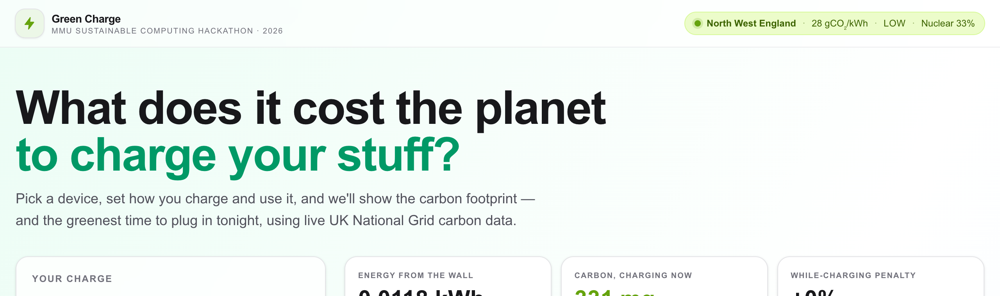
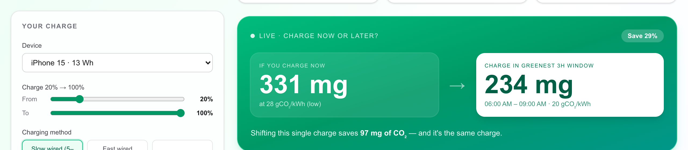
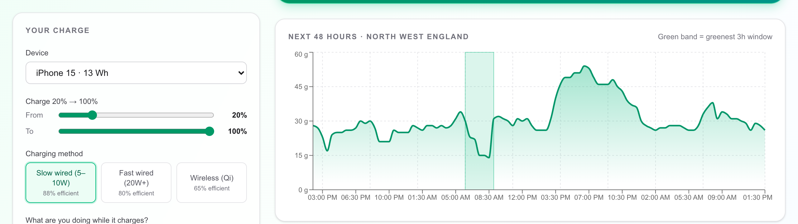
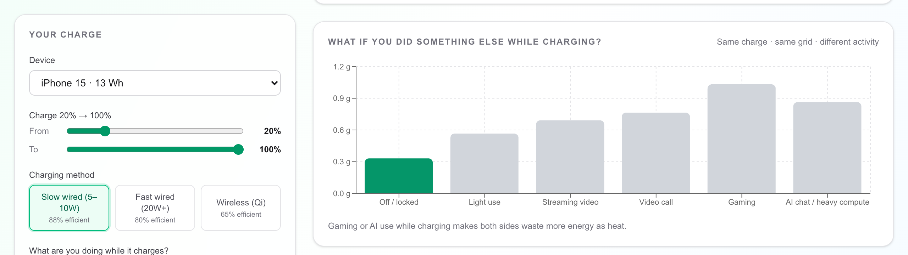
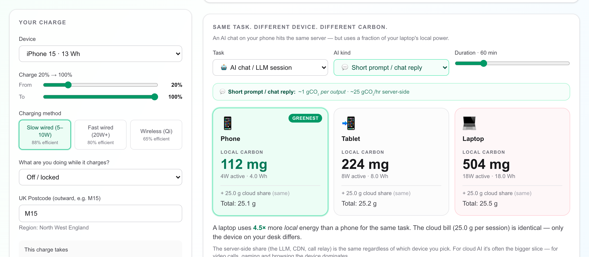
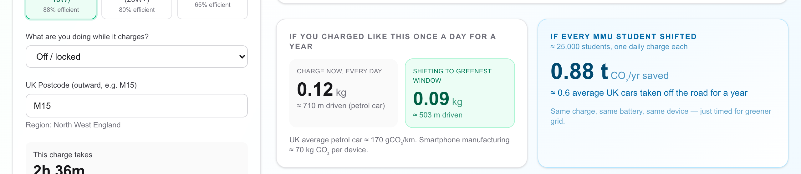

<div align="center">

# ⚡ Green Charge

### What does it cost the planet to charge your stuff?

A carbon-aware calculator for the everyday charge — phone, tablet, laptop — using live UK National Grid data.

*Built for the [MMU Sustainable Computing Hackathon 2026](https://greencompute.uk/)*



</div>

---

## What it does

Green Charge tells you the **carbon footprint of charging a specific device right now**, and then shows you **when in the next 48 hours it would be greener to plug in instead**. It uses live UK National Grid carbon-intensity data — half-hour resolution, by postcode.

The headline finding: even in a relatively green region like Manchester, **timing a single charge to the greenest window in the day routinely saves 70–80% of the CO₂** for the exact same charge. No new hardware, no new battery, no efficiency tricks — just timing.

The app also models three things most carbon calculators ignore:

1. The **while-charging penalty** — using your device while it charges wastes more energy as heat (15–30% depending on activity).
2. **Same task, different device** — running an AI chat on your phone vs your MacBook uses about 4.5× less local energy, even though the cloud bill is identical.
3. **Same task, different AI** — short chat replies, long-context coding, image generation and video generation differ by ~30× in server-side carbon per hour.

---

## Live demo

```bash
git clone https://github.com/sharia143/green-charge.git
cd green-charge
npm install
npm run dev
```

Then open <http://localhost:3000>. No API keys, no env vars, no auth — it just calls the public [carbonintensity.org.uk](https://carbonintensity.org.uk/) API directly from your browser.

A pre-built **static export** is at [`docs/GreenCharge-static.zip`](docs/GreenCharge-static.zip) if you want to host it somewhere yourself.

---

## Screenshots

### The headline: charge now or charge later?



Live grid carbon intensity for your region, compared against the greenest window in the next 48 hours, for the exact charge you described.

### 48-hour grid forecast



The green band on the chart marks the greenest window matching your charge length.

### While-charging penalty



Six activities (locked, light use, streaming, video call, gaming, AI use) modelled against the same charge — selected activity highlighted, others greyed.

### Same task, different device, different AI



Three device cards (phone / tablet / laptop) compared for the same task. When the task is AI, an extra picker exposes the **AI kind** — short prompt, long context, image generation, or video generation — each with its own server-side carbon share.

### Campus-scale impact



Scaled to MMU's ~25,000 students, shifting one daily charge each adds up to roughly 4–8 tonnes of CO₂ avoided per year — equivalent to taking 3–5 average UK cars off the road for a year.

---

## How the math works

Three ingredients:

**1. Grid carbon intensity** — from the National Grid ESO Carbon Intensity API, by UK postcode:

```
GET https://api.carbonintensity.org.uk/regional/intensity/{from}/fw48h/postcode/{postcode}
→ array of 96 half-hour periods, each with gCO₂/kWh forecast + generation mix
```

**2. Charge energy** — based on the device's battery capacity, the charge delta, and the charging method's efficiency:

```
batteryEnergyWh   = batteryWh × (endPct − startPct) / 100
chargingWh        = batteryEnergyWh / chargingEfficiency × whileUsePenalty
activeUseWh       = (idleW + activityExtraW) × durationHours      // 0 if locked
totalKWh          = (chargingWh + activeUseWh) / 1000
```

Charging efficiencies used: slow wired 88%, fast wired 80%, wireless 65%.
While-use penalty: 0% (off), 5% (light), 10% (video/call), 18% (AI), 25% (gaming).

**3. Carbon** = `totalKWh × gridCarbonIntensity`. The "greenest window" is the contiguous half-hour run that minimises average intensity, sized to match the estimated charge length.

For the **same-task-different-device** view:

```
deviceG  = deviceActiveW × durationHours / 1000 × gridCarbonIntensity
serverG  = taskServerGPerHour × durationHours      // constant across devices
total    = deviceG + serverG
```

The ratio displayed is `max(deviceG) / min(deviceG)` — the device-only delta, because that's the lever the user controls.

---

## Tech stack

- **Next.js 16** (App Router, Turbopack) + **TypeScript**
- **Tailwind CSS 4** for styling
- **Recharts** for the 48-hour area chart and the activity bar chart
- All client-side — `output: 'export'` produces a fully static site
- Data: live [carbonintensity.org.uk](https://carbonintensity.org.uk/) API, no auth, no key

---

## Run locally

```bash
npm install
npm run dev      # http://localhost:3000 with hot reload
```

Build a deployable static site:

```bash
npm run build    # outputs to ./out/
```

Then host the `out/` folder anywhere (Netlify, Vercel, GitHub Pages, an S3 bucket, your laptop's `npx serve`).

---

## Methodology and caveats

This is a first-order calculator built in a two-day hackathon. The numbers are honest order-of-magnitude estimates, not peer-reviewed measurements. Specifically:

- **Operational carbon only.** Manufacturing one iPhone emits ~70 kg CO₂ — roughly **2–3 years of typical charging**. The biggest behaviour change isn't *when* you charge; it's keeping the device a year longer. The UI surfaces this in a "Did you know" card.
- **Heat-loss numbers are industry ranges, not measurements.** We could not find a clean public dataset for the "while-charging penalty," so we used 15–30% based on lithium-ion charging-efficiency literature.
- **Server-side AI carbon is order-of-magnitude.** Cloud LLM/image/video carbon depends on model, datacenter, and load. We used reasonable middle estimates from published inference-energy work and made the assumption explicit in the UI.
- **Device specs are typical, not exact.** Battery Wh, charging power and idle draw vary by manufacturer batch and firmware. We picked conservative middle values.

What the calculator does **not** model: networking carbon, embodied device carbon, water use, mineral footprint.

---

## What's in this repo

```
green-charge/
├── README.md                       ← this file
├── src/
│   ├── app/
│   │   ├── page.tsx                ← single-page UI (client component)
│   │   ├── layout.tsx              ← metadata
│   │   └── globals.css
│   └── lib/
│       ├── devices.ts              ← device DB, activity power overlays, AI sub-tasks
│       ├── carbon-api.ts           ← UK Carbon Intensity API client + greenest-window finder
│       └── calc.ts                 ← energy/carbon formulas + annual + MMU extrapolation
├── docs/
│   ├── brief.pdf                   ← the hackathon brief
│   ├── GreenCharge-Demo.pptx       ← 9-slide presentation deck
│   ├── GreenCharge-Script.docx     ← speaker script + live-demo checklist
│   ├── GreenCharge-static.zip      ← pre-built static export of the site
│   └── screenshots/                ← screenshots used in this README
├── public/                         ← favicon and static assets
├── next.config.ts                  ← output: 'export' for static builds
└── package.json
```

---

## Demo flow (for live presentation)

The walkthrough is in [`docs/GreenCharge-Script.docx`](docs/GreenCharge-Script.docx), final page. In short:

1. **Land** on http://localhost:3000 — point at the live grid pill (top-right).
2. **Hero card** — read the now-vs-later numbers and the "Save X%" badge.
3. **Drag** the To% slider to show numbers move live.
4. **Activity → Gaming** — show the +25% while-charging penalty appearing in the KPI strip.
5. **Same task, different device** section:
   - Walk the AI-kind picker: Short prompt → Long context → Image gen → Video gen.
   - Then switch Task to Video call to show device dominating.
6. **MMU campus card** — read the 4–8 t / year line out loud.

---

## Built by

**Sharia Alam** · ID 25937881 · Manchester Metropolitan University

Built for the [Sustainable Computing Hackathon 2026](https://greencompute.uk/) — run by Dr. Michael Bane and the [GreenCompute UK](https://greencompute.uk/) team at MMU.

---

## Acknowledgements

- [National Grid ESO](https://www.nationalgrideso.com/) for the free, public, no-auth [Carbon Intensity API](https://carbonintensity.org.uk/)
- [GreenCompute UK](https://greencompute.uk/) and the [Green Software Foundation](https://learn.greensoftware.foundation/) for the underlying concepts and methodology references
- Device-power figures cross-referenced against manufacturer datasheets and public teardowns

---

*Estimates only. Don't make policy decisions from this tool — but do shift your overnight charging by two hours.*
